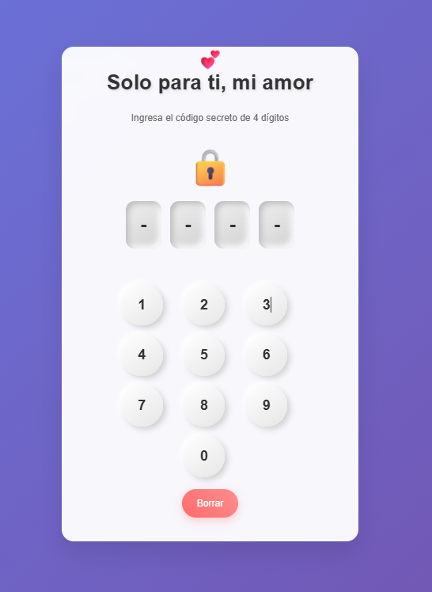
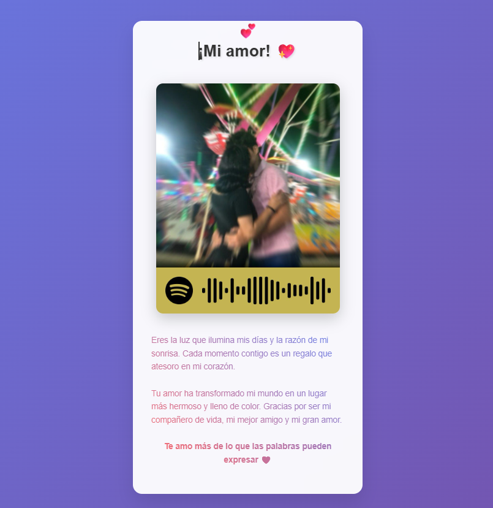

# 💌 Carta Interactiva: "Para Ti ❤️"

Una carta web interactiva hecha con HTML, CSS y JavaScript, diseñada como regalo de cumpleaños para alguien muy especial.  
Este proyecto busca demostrar que el código también puede transmitir emociones, crear momentos y guardar secretos (como una contraseña).

---

## 🌟 Características

- 🔐 **Protección por PIN**: acceso restringido mediante un código secreto de 4 dígitos (2704).
- 💫 **Animaciones suaves y diseño responsive** con un estilo visual romántico y elegante.
- 🎵 Música de fondo que suena al desbloquear, para que la experiencia sea completa (porque sin banda sonora no hay peli épica).
- 🎧 Integración con Spotify: una imagen con código lleva a una playlist secreta.
- 🩷 **Mensaje personalizado** lleno de amor (y un poco de JavaScript).
- 🎈 **Corazones flotantes** que aparecen al desbloquear la carta. Sí, literal.

---

## 🛠 Tecnologías utilizadas

| Tecnología | Uso |
|------------|-----|
| HTML       | Estructura de la carta |
| CSS        | Estilo visual y animaciones románticas |
| JavaScript | Validación del código, interacción y efectos especiales |

---

## 🚀 Ver en línea

🔗 [Haz clic aquí para ver la carta desplegar su magia](https://cumpleminino.netlify.app/)  

---

## 🔐 Contraseña

2704  
_Nuestro aniversario._

---

## 📸 Vista previa

### Pantalla de acceso

### Contenido romántico desbloqueado

---

## ✨ Detalles técnicos

- Interfaz de login con representación visual del código ingresado.
- Validación de entrada desde teclado virtual y físico.
- Mensajes de error animados si el código no coincide.
- Reproducción suave de animaciones con @keyframes y transition.
- Uso de setInterval, setTimeout y manipulación DOM para efectos dinámicos.

---

## ❤️ Pensado para...

Este proyecto fue creado con la intención de **decir "te amo" sin usar un papel**, haciendo que el destinatario interactúe, sonría y se sienta parte de algo único.

---

## 👩‍💻 Autora

**Pamela Rodríguez**  
Estudiante de Ingeniería de Software  
Desarrolladora fullstack en progreso.  
Fan de usar el código para cosas que importan (y corazones que laten más fuerte). 💘

## 📬 Conecta conmigo

- GitHub: [@pame-dev](https://github.com/pame-dev)
- LinkedIn: [Pamela Rodríguez](https://www.linkedin.com/in/daira-pamela-rodriguez-gomez-167452324/)

---

## 📝 Nota final

> _"Podría haber escrito una carta, pero preferí escribir una experiencia."_  
> — Pame, probablemente en algún commit a medianoche.
